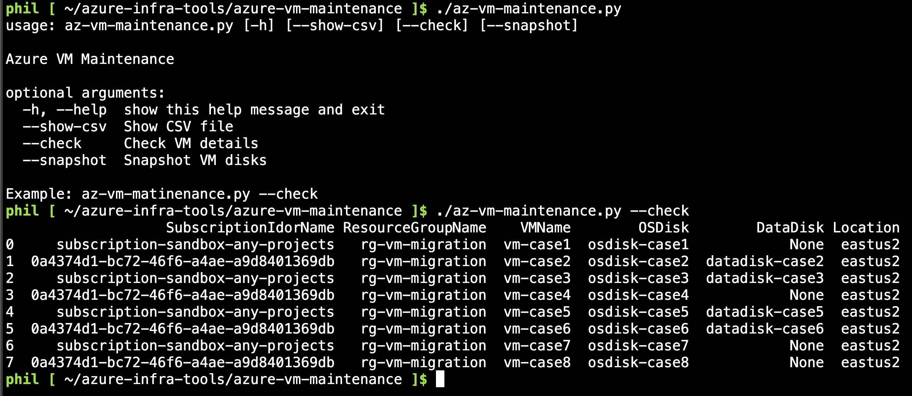
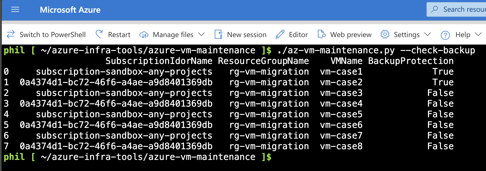

# Azure VM Maintenance Script

This project provides a set of scripts and tools to manage and maintain Azure Virtual Machines (VMs). It includes functionalities for listing VM details and creating snapshots of VM disks.



## Prerequisites

- Python 3.9 or higher
- Azure account with necessary permissions
- Azure CLI installed and configured

## Installation

1. Open Cloud Shell or your own local terminal
    ```sh
    https://shell.azure.com
    ```


2. Clone the repository:
    ```sh
    git clone https://github.com/pichuang/azure-infra-tools.git
    cd azure-infra-tools/azure-vm-maintenance
    ```

3. Install the required Python packages:
    ```sh
    bash ./install.sh
    # Or
    # pip install -r requirements.txt
    ```

4. Ensure you are logged in to Azure CLI:
    ```sh
    az login
    # Or
    # az login --tenant <your-tenant-id> --use-device-code
    ```

## Usage

### Prepare CSV file

Example CSV file: [1-vm-protect.example.csv](1-vm-protect.example.csv)

#### Check VM Details

To list VM details, run:
```bash
python az-vm-maintenance.py --check
```

#### Snapshot VM Disks

To create snapshots of VM disks, run:
```bash
python az-vm-maintenance.py --snapshot
```

#### Check Backup Protection



To check if the VM has backup protection enabled, run:
```bash
python az-vm-maintenance.py --check-backup
```

### Examples

1. Check VM details
    ```bash
    ./az-vm-maintenance.py --check
    ```

    Output:
    ```
    $ ./az-vm-maintenance.py --check
                      SubscriptionIdorName ResourceGroupName    VMName        OSDisk        DataDisk Location
    0     subscription-sandbox-any-projects   rg-vm-migration  vm-case1  osdisk-case1            None  eastus2
    1  0a4374d1-bc72-46f6-a4ae-a9d8401369db   rg-vm-migration  vm-case2  osdisk-case2  datadisk-case2  eastus2
    2     subscription-sandbox-any-projects   rg-vm-migration  vm-case3  osdisk-case3  datadisk-case3  eastus2
    3  0a4374d1-bc72-46f6-a4ae-a9d8401369db   rg-vm-migration  vm-case4  osdisk-case4            None  eastus2
    4     subscription-sandbox-any-projects   rg-vm-migration  vm-case5  osdisk-case5  datadisk-case5  eastus2
    5  0a4374d1-bc72-46f6-a4ae-a9d8401369db   rg-vm-migration  vm-case6  osdisk-case6  datadisk-case6  eastus2
    6     subscription-sandbox-any-projects   rg-vm-migration  vm-case7  osdisk-case7            None  eastus2
    7  0a4374d1-bc72-46f6-a4ae-a9d8401369db   rg-vm-migration  vm-case8  osdisk-case8            None  eastus2
    ```
