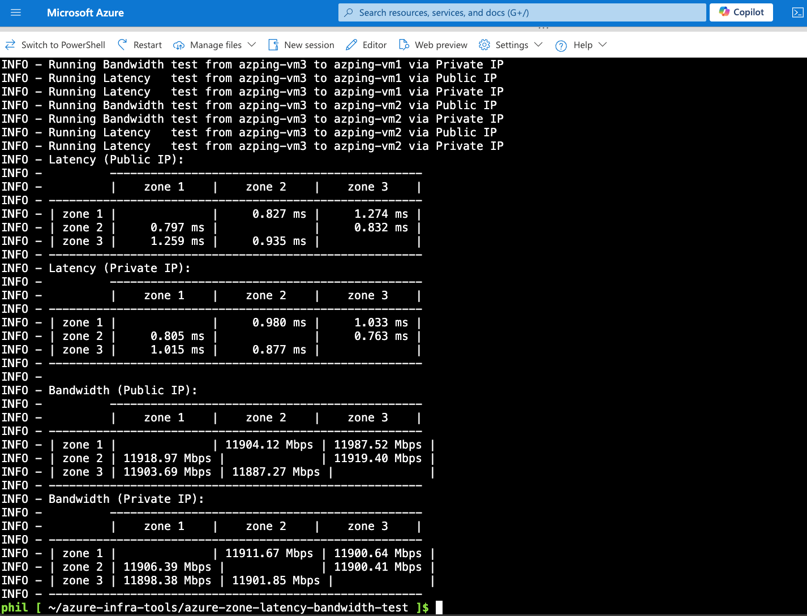

# Azure Zone Latency/Bandwidth Test

This script is designed to test latency and bandwidth between virtual machines (VMs) in different availability zones within an Azure region. It automates the creation of resource groups, virtual networks, network security groups, and VMs, and then runs latency and bandwidth tests using `iperf3` and `sockperf`.



## Prerequisites

- Python 3.9 or higher
- Azure CLI
- Azure SDK for Python
- `paramiko` library for SSH connections

## Installation

1. Open Cloud Shell or your own local terminal
    ```sh
    https://shell.azure.com
    ```

2. Clone the repository:
    ```sh
    git clone https://github.com/pichuang/azure-infra-tools.git
    cd azure-infra-tools/azure-zone-latency-bandwidth-test
    ```

3. Install the required Python packages:
    ```sh
    bash ./install.sh
    # Or
    # pip install -r requirements.txt
    ```

4. Ensure you are logged in to Azure CLI:
    ```sh
    az login
    # Or
    # az login --tenant <your-tenant-id> --use-device-code
    ```

## Usage

### Command Line Arguments

- `--tenant`: Azure Tenant ID or Name (optional)
- `--subscription`: Azure Subscription ID (required)
- `--resource-group-name`: Resource Group Name (required)
- `--vm-type`: VM Type (default: `Standard_D8lds_v5`)
- `--location`: Azure Region (default: `southeastasia`)
- `--enable-accelerated-networking`: Enable Accelerated Networking (default: `True`)
- `--admin-username`: Admin username for the VM (default: `repairman`)
- `--admin-password`: Admin password for the VM (default: `xxxxxxxxxxxxxx`)
- `--network-cidr`: Network CIDR (default: `192.168.100.0/24`)
- `--force-delete`: Force delete the resource group (optional)
- `--run`: Run latency and bandwidth tests directly (optional)
- `--show-info`: Show VM info (IP, username, password) (optional)
- `--skip-bandwidth-test`: Skip bandwidth tests (optional)
- `--skip-latency-test`: Skip latency tests (optional)

### Examples

1. **Create Resources and Run Tests:**
    ```sh
    ./azure-zone-latency-bandwidth-test.py --subscription <your-subscription-id> --resource-group-name rg-hello-sea
    ```

    Output:
    ```sh
    phil [ ~/azure-infra-tools/azure-zone-latency-bandwidth-test ]$ ./azure-zone-latency-bandwidth-test.py --subscription xxxxxxxx-xxxx-xxxx-xxxx-xxxxxxxxxxxx --resource-group-name rg-hello-sea
    INFO - Resource group rg-hello-sea has been created.
    INFO - VNet azping-mgmt-vnet has been created.
    INFO - Subnet default has been created.
    INFO - Network security group azping-nsg has been created.
    INFO - VM azping-vm1 has been created.
    INFO - VM azping-vm2 has been created.
    INFO - VM azping-vm3 has been created.
    INFO - All VMs created. Checking network reachability...
    INFO - Checking if VMs are reachable...
    ...omitted...
    ```

2. **Show VM Information:**
    ```sh
    ./azure-zone-latency-bandwidth-test.py --subscription <your-subscription-id> --resource-group-name rg-hello-sea --show-info
    ```

    Output:
    ```
    phil [ ~/azure-infra-tools/azure-zone-latency-bandwidth-test ]$ ./azure-zone-latency-bandwidth-test.py --subscription xxxxxxxx-xxxx-xxxx-xxxx-xxxxxxxxxxxx --resource-group-name rg-hello-sea --show-info
    INFO - VM Name: azping-vm1, IP: a.a.a.a, Username: repairman, Password: xxxxxxxxxxxxxx
    INFO - To login azping-vm1 with one command: expect -c 'spawn ssh repairman@a.a.a.a; expect "password:"; send "xxxxxxxxxxxxxx\r"; interact'
    INFO - VM Name: azping-vm2, IP: b.b.b.b, Username: repairman, Password: xxxxxxxxxxxxxx
    INFO - To login azping-vm2 with one command: expect -c 'spawn ssh repairman@b.b.b.b; expect "password:"; send "xxxxxxxxxxxxxx\r"; interact'
    INFO - VM Name: azping-vm3, IP: c.c.c.c, Username: repairman, Password: xxxxxxxxxxxxxx
    INFO - To login azping-vm3 with one command: expect -c 'spawn ssh repairman@c.c.c.c; expect "password:"; send "xxxxxxxxxxxxxx\r"; interact'
    ```

3. **Force Delete Resource Group:**
    ```sh
    ./azure-zone-latency-bandwidth-test.py --subscription <your-subscription-id> --resource-group-name rg-hello-sea --force-delete
    ```

    Output:
    ```sh
    phil [ ~/azure-infra-tools/azure-zone-latency-bandwidth-test ]$ ./azure-zone-latency-bandwidth-test.py --subscription xxxxxxxx-xxxx-xxxx-xxxx-xxxxxxxxxxxx --resource-group-name rg-hello-sea --force-delete
    INFO - Resource group rg-hello-sea deletion initiated, No need to wait for the deletion to complete
    ```

4. **Run All Tests Directly:**
    ```sh
    ./azure-zone-latency-bandwidth-test.py --subscription <your-subscription-id> --resource-group-name rg-hello-sea --run
    ```

    Output:
    ```sh
    phil [ ~/azure-infra-tools/azure-zone-latency-bandwidth-test ]$ ./azure-zone-latency-bandwidth-test.py --subscription 0a4374d1-bc72-46f6-a4ae-a9d8401369db --resource-group-name rg-hello-sea --run 
    INFO - Public IP address for azping-vm1: a.a.a.a
    INFO - Public IP address for azping-vm2: b.b.b.b
    INFO - Public IP address for azping-vm3: c.c.c.c
    INFO - Running Bandwidth test from azping-vm1 to azping-vm2 via Public IP
    INFO - Running Bandwidth test from azping-vm1 to azping-vm2 via Private IP
    INFO - Running Latency   test from azping-vm1 to azping-vm2 via Public IP
    INFO - Running Latency   test from azping-vm1 to azping-vm2 via Private IP
    INFO - Running Bandwidth test from azping-vm1 to azping-vm3 via Public IP
    INFO - Running Bandwidth test from azping-vm1 to azping-vm3 via Private IP
    INFO - Running Latency   test from azping-vm1 to azping-vm3 via Public IP
    INFO - Running Latency   test from azping-vm1 to azping-vm3 via Private IP
    ...omitted...
    ```

5. **Run Only Bandwidth Tests:**
    ```sh
    ./azure-zone-latency-bandwidth-test.py --subscription <your-subscription-id> --resource-group-name rg-zone-test --skip-latency-test
    ```

## Output

The script will log the following information:
- Creation status of resource groups, virtual networks, network security groups, and VMs.
- Public and private IP addresses of the VMs.
- Results of latency and bandwidth tests between the VMs.

## Notes

- Ensure that the provided admin username and password meet Azure's security requirements.
- The script assumes that the `iperf3` and `sockperf` tools are available on the VMs. The script will attempt to install these tools if they are not already present.
- The script uses `paramiko` for SSH connections to the VMs. Ensure that the VMs' network security groups allow SSH access.

## License

This project is licensed under the MIT License. See the [LICENSE](../LICENSE) file for details.