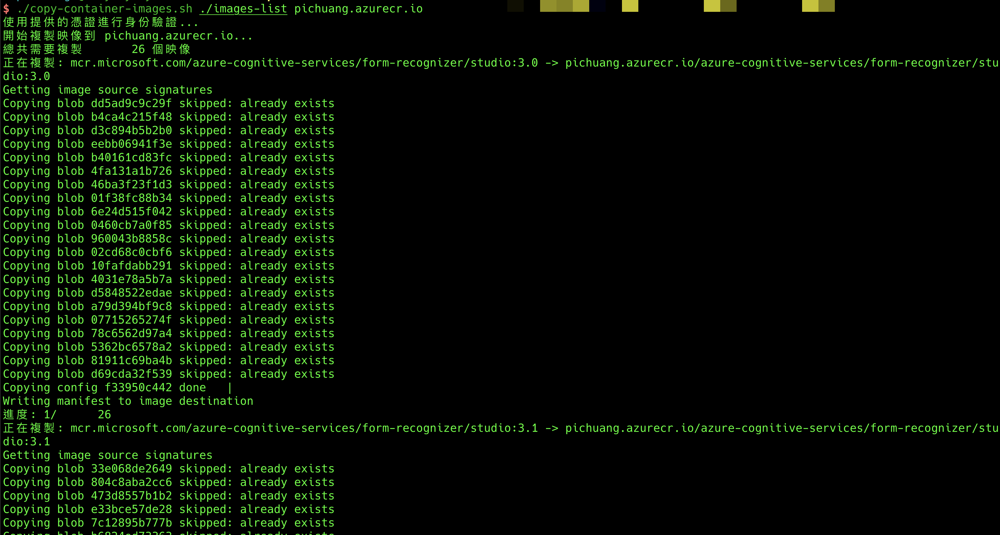

# Container Image Copy Script

A utility script for copying container images from a source registry to a destination registry while preserving the original path structure.



## Features

- Copies container images from source to destination registry
- Preserves the original path structure in the destination registry
- Supports authentication with username and password
- Automatically skips comments and empty lines in the image list file
- Checks for skopeo installation before running

## Prerequisites

  - [skopeo](https://github.com/containers/skopeo) must be installed
  - On macOS: `brew install skopeo`
  - On Ubuntu: `apt-get install skopeo`

## Usage

```bash
./copy-container-images.sh <images-list-file> <dest-registry> [dest-username] [dest-password]
```

### Parameters

- `images-list-file`: Path to a file containing a list of container images to copy
- `dest-registry`: Destination registry URL (e.g., `pichuang.azurecr.io`)
- `dest-username` (optional): Username for destination registry authentication
- `dest-password` (optional): Password for destination registry authentication

### Example

```bash
./copy-container-images.sh ./images-list pichuang.azurecr.io pichuang "password123"
```

## Image List Format

The image list file should contain one image per line. Lines starting with `#` are treated as comments and will be ignored. Empty lines are also ignored.

Example `images-list` file:

```
# Studio
mcr.microsoft.com/azure-cognitive-services/form-recognizer/studio:3.0
mcr.microsoft.com/azure-cognitive-services/form-recognizer/studio:3.1
mcr.microsoft.com/azure-cognitive-services/form-recognizer/studio:latest

# Read
mcr.microsoft.com/azure-cognitive-services/form-recognizer/read-3.0:latest
```

## How It Works

1. The script reads the image list file line by line
2. For each image, it extracts the path (excluding the registry)
3. It then constructs the destination image URL by combining the destination registry with the extracted path
4. Finally, it uses skopeo to copy the image from source to destination
