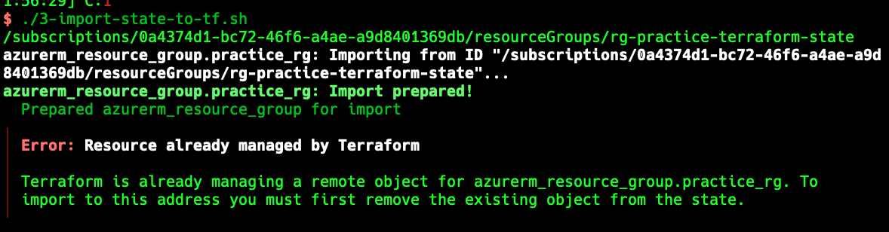
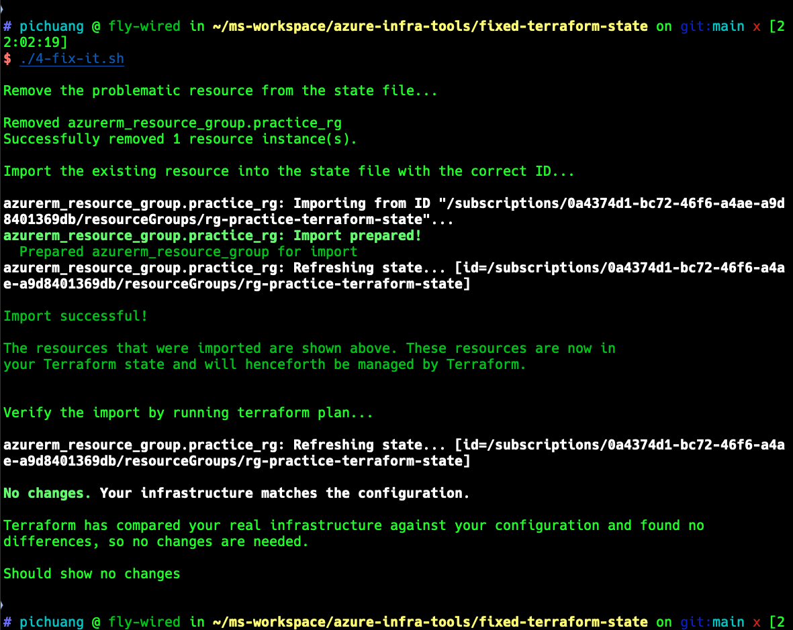

# Terraform 狀態檔案修復教學

## 概述

本教學旨在協助第一次遇到 Terraform 狀態檔案問題的工程師,了解如何修復狀態不一致的情況。透過實際操作範例,您將學會如何處理 Terraform 狀態檔案與實際 Azure 資源不同步的問題。

## 什麼是 Terraform 狀態檔案?

Terraform 狀態檔案 (`terraform.tfstate`) 記錄了 Terraform 所管理的基礎設施資源的當前狀態。當狀態檔案與實際雲端資源不一致時,可能會導致:

- 無法正確執行 `terraform apply`
- 資源重複建立或刪除
- 部署失敗或產生預期外的變更

## 問題情境

常見的狀態不一致情況包括:

1. **手動刪除資源**:透過 Azure Portal 或 CLI 刪除了 Terraform 管理的資源,但狀態檔案仍記錄該資源存在
2. **手動建立資源**:透過 Azure CLI 建立了資源,但 Terraform 狀態檔案沒有記錄
3. **狀態檔案損壞**:狀態檔案因某些原因損壞或遺失
4. **多人協作衝突**:團隊成員同時修改導致狀態不一致

## 前置需求

- 已安裝 [Terraform](https://www.terraform.io/downloads)
- 已安裝 [Azure CLI](https://docs.microsoft.com/cli/azure/install-azure-cli)
- 已登入 Azure (`az login`)
- 具備 Azure 訂閱的適當權限

## 教學步驟

本教學透過模擬一個完整的問題情境,帶您了解如何修復 Terraform 狀態:

### 步驟 0:建立初始環境 (`0-deploy-target-via-tf.sh`)

```bash
./0-deploy-target-via-tf.sh
```

**目的**:使用 Terraform 建立一個 Azure 資源群組,建立初始的狀態檔案。

**執行內容**:
- 初始化 Terraform (`terraform init`)
- 套用設定並建立資源 (`terraform apply -auto-approve`)

**預期結果**:
- 建立名為 `rg-practice-terraform-state` 的資源群組
- 產生 `terraform.tfstate` 檔案,記錄資源狀態

---

### 步驟 1:模擬問題 - 手動刪除資源 (`1-delete-target-via-cli.azcli`)

```bash
./1-delete-target-via-cli.azcli
```

**目的**:透過 Azure CLI 直接刪除資源,模擬實際環境中可能發生的情況。

**執行內容**:
- 使用 `az group delete` 刪除資源群組

**問題產生**:
- Azure 上的資源已被刪除
- 但 Terraform 狀態檔案仍然記錄該資源存在
- 此時執行 `terraform plan` 會出現錯誤或不一致的結果

---

### 步驟 2:重新建立資源 (`2-create-target-via-cli.azcli`)

```bash
./2-create-target-via-cli.azcli
```

**目的**:透過 Azure CLI 重新建立相同名稱的資源,進一步模擬狀態不一致的情況。

**執行內容**:
- 使用 `az group create` 建立資源群組

**問題加劇**:
- Azure 上有實際資源
- Terraform 狀態檔案記錄的是舊的資源 ID
- 兩者的資源 ID 不一致,無法正常管理

---

### 步驟 3:嘗試匯入 - 失敗示範 (`3-import-state-to-tf.sh`)



```bash
./3-import-state-to-tf.sh
```

**目的**:展示直接嘗試匯入資源會失敗的情況。

**執行內容**:
- 查詢現有資源的 ID
- 嘗試使用 `terraform import` 匯入資源

**預期結果**:
- 匯入失敗,因為狀態檔案中已經存在該資源的記錄
- 錯誤訊息類似:「資源已存在於狀態檔案中」

**學習重點**:
- 在匯入資源前,需要先清理狀態檔案中的舊記錄

---

### 步驟 4:正確的修復流程 (`4-fix-it.sh`)



```bash
./4-fix-it.sh
```

**目的**:展示正確的修復流程,解決狀態不一致問題。

**執行內容**:

#### 4.1 移除狀態檔案中的舊記錄
```bash
terraform state rm 'azurerm_resource_group.practice_rg'
```
- 從狀態檔案中移除有問題的資源記錄
- 這不會刪除 Azure 上的實際資源,只是清理狀態檔案

#### 4.2 重新匯入實際資源
```bash
terraform import azurerm_resource_group.practice_rg $(az group show -n rg-practice-terraform-state --query id -o tsv)
```
- 查詢 Azure 上實際資源的 ID
- 將實際資源匯入到 Terraform 狀態檔案中
- 建立狀態檔案與實際資源的正確對應關係

#### 4.3 驗證修復結果
```bash
terraform plan
```
- 檢查是否還有未同步的變更
- 正常情況下應該顯示「No changes」

**預期結果**:
- 狀態檔案與實際資源完全同步
- `terraform plan` 顯示沒有需要變更的內容
- 可以正常使用 Terraform 管理資源

---

## 核心指令說明

### `terraform state rm`
```bash
terraform state rm 'resource_type.resource_name'
```
- 從狀態檔案中移除指定的資源
- 不會影響實際的雲端資源
- 用於清理錯誤或過時的狀態記錄

### `terraform import`
```bash
terraform import resource_type.resource_name resource_id
```
- 將已存在的雲端資源匯入到 Terraform 狀態檔案
- 需要提供資源的完整 ID
- 匯入後可以使用 Terraform 管理該資源

### `terraform state list`
```bash
terraform state list
```
- 列出狀態檔案中所有已管理的資源
- 用於檢查狀態檔案內容

### `terraform state show`
```bash
terraform state show resource_type.resource_name
```
- 顯示特定資源在狀態檔案中的詳細資訊
- 用於診斷問題

---

## 實際應用場景

### 場景 1:誤刪資源後的復原

**情況**:團隊成員不小心透過 Portal 刪除了 Terraform 管理的資源。

**處理步驟**:
1. 確認資源是否真的被刪除
2. 從狀態檔案中移除該資源記錄:`terraform state rm`
3. 重新執行 `terraform apply` 建立資源
4. 驗證狀態一致性

### 場景 2:手動建立的資源需要納入管理

**情況**:緊急情況下透過 CLI 手動建立資源,現在想用 Terraform 管理。

**處理步驟**:
1. 在 Terraform 設定檔中加入該資源的定義
2. 查詢資源的完整 ID
3. 使用 `terraform import` 匯入資源
4. 執行 `terraform plan` 檢查是否有差異
5. 如有差異,調整 Terraform 設定檔使其與實際資源一致

### 場景 3:狀態檔案遺失

**情況**:狀態檔案因某些原因遺失或損壞。

**處理步驟**:
1. 列出所有需要管理的現有資源
2. 逐一使用 `terraform import` 匯入每個資源
3. 執行 `terraform plan` 檢查差異
4. 調整設定檔直到沒有差異

---

## 最佳實務建議

### 1. 使用遠端後端 (Remote Backend)

建議使用 Azure Storage Account 作為遠端後端儲存狀態檔案:

```hcl
terraform {
  backend "azurerm" {
    resource_group_name  = "rg-terraform-state"
    storage_account_name = "tfstatexxxxx"
    container_name       = "tfstate"
    key                  = "prod.terraform.tfstate"
  }
}
```

**優點**:
- 團隊成員共用同一份狀態檔案
- 支援狀態鎖定,避免並行修改衝突
- 自動備份和版本控制

### 2. 定期備份狀態檔案

在執行重大變更前,先備份狀態檔案:

```bash
cp terraform.tfstate terraform.tfstate.backup.$(date +%Y%m%d%H%M%S)
```

### 3. 避免手動修改資源

- 所有變更都應該透過 Terraform 執行
- 如果必須手動變更,記得更新狀態檔案
- 建立明確的操作流程和文件

### 4. 使用狀態鎖定

啟用狀態鎖定機制,防止多人同時修改:

```hcl
terraform {
  backend "azurerm" {
    # ... 其他設定
    use_azuread_auth = true
  }
}
```

### 5. 定期執行 `terraform plan`

定期檢查狀態檔案與實際資源是否一致:

```bash
terraform plan -detailed-exitcode
```

---

## 疑難排解

### Q1: `terraform import` 時出現「資源已存在」錯誤

**答**:先使用 `terraform state rm` 移除狀態檔案中的舊記錄,再執行匯入。

### Q2: 如何找到 Azure 資源的完整 ID?

**答**:使用 Azure CLI:
```bash
az resource show --resource-group <rg-name> --name <resource-name> --resource-type <type> --query id -o tsv
```

### Q3: 匯入後 `terraform plan` 仍顯示有變更

**答**:這表示 Terraform 設定檔與實際資源有差異。需要調整設定檔中的參數,使其與實際資源完全一致。

### Q4: 可以直接編輯 `terraform.tfstate` 檔案嗎?

**答**:不建議。應該使用 Terraform 提供的指令(`terraform state`)來操作狀態檔案,避免造成損壞。

### Q5: 如何復原 `terraform state rm` 的操作?

**答**:如果有備份檔案,可以復原。否則需要重新執行 `terraform import`。

---

## 進階主題

### 移動資源到不同的狀態檔案

```bash
terraform state mv -state-out=../other/terraform.tfstate \
  azurerm_resource_group.example azurerm_resource_group.example
```

### 重新命名資源

```bash
terraform state mv azurerm_resource_group.old_name azurerm_resource_group.new_name
```

### 批次匯入多個資源

建立腳本批次處理:

```bash
#!/bin/bash
resources=(
  "azurerm_resource_group.rg1:/subscriptions/.../resourceGroups/rg1"
  "azurerm_resource_group.rg2:/subscriptions/.../resourceGroups/rg2"
)

for resource in "${resources[@]}"; do
  IFS=':' read -r tf_resource azure_id <<< "$resource"
  terraform import "$tf_resource" "$azure_id"
done
```

---

## 參考資源

- [Terraform State 官方文件](https://www.terraform.io/docs/language/state/index.html)
- [Terraform Import 指令](https://www.terraform.io/docs/cli/commands/import.html)
- [Terraform State 指令](https://www.terraform.io/docs/cli/commands/state/index.html)
- [Azure Provider 文件](https://registry.terraform.io/providers/hashicorp/azurerm/latest/docs)

---

## 清理環境

完成教學後,記得清理測試資源:

```bash
terraform destroy -auto-approve
```

或手動刪除:

```bash
az group delete --name rg-practice-terraform-state --yes
```

---

## 總結

修復 Terraform 狀態檔案的核心流程:

1. **識別問題**:確認狀態檔案與實際資源的差異
2. **清理狀態**:使用 `terraform state rm` 移除錯誤記錄
3. **重新匯入**:使用 `terraform import` 匯入實際資源
4. **驗證結果**:執行 `terraform plan` 確認沒有差異
5. **預防措施**:建立流程避免未來再次發生

記住:狀態檔案是 Terraform 的核心,妥善管理狀態檔案是成功使用 Terraform 的關鍵。

