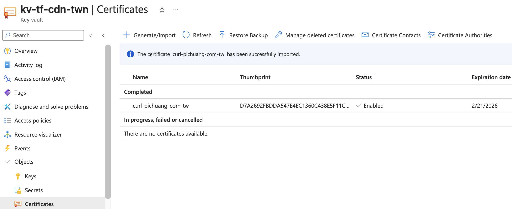
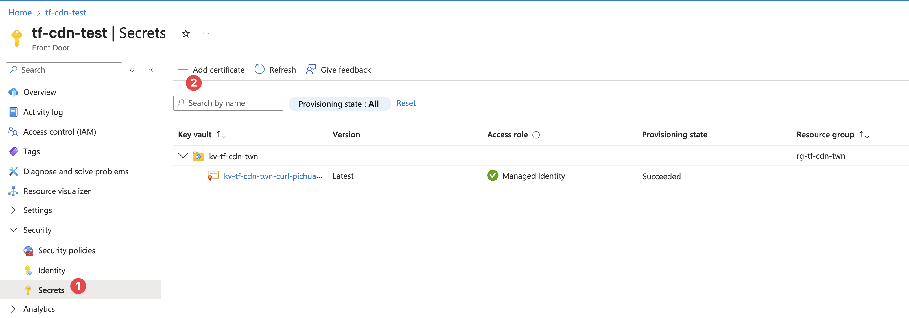

# Let's Encrypt Self Signed Guide

## Requirement

- Can not use CNAME
- DNS-01 is better than HTTP-01

## Walkthrough

### Certbot Output

```bash
# pichuang @ fly-by-cyber in ~/ms-workspace/azure-infra-tools/letencryption-self-signed on git:main x [16:47:02]
$ ./1-certbot.sh
Saving debug log to /azure-infra-tools/letencryption-self-signed/certbot-logs/letsencrypt.log
Enter email address or hit Enter to skip.
 (Enter 'c' to cancel): xxx@gmail.com

- - - - - - - - - - - - - - - - - - - - - - - - - - - - - - - - - - - - - - - -
Please read the Terms of Service at:
https://letsencrypt.org/documents/LE-SA-v1.6-August-18-2025.pdf
You must agree in order to register with the ACME server. Do you agree?
- - - - - - - - - - - - - - - - - - - - - - - - - - - - - - - - - - - - - - - -
(Y)es/(N)o: Y

- - - - - - - - - - - - - - - - - - - - - - - - - - - - - - - - - - - - - - - -
Would you be willing, once your first certificate is successfully issued, to
share your email address with the Electronic Frontier Foundation, a founding
partner of the Let's Encrypt project and the non-profit organization that
develops Certbot? We'd like to send you email about our work encrypting the web,
EFF news, campaigns, and ways to support digital freedom.
- - - - - - - - - - - - - - - - - - - - - - - - - - - - - - - - - - - - - - - -
(Y)es/(N)o: Y
Account registered.
Requesting a certificate for curl.pichuang.com.tw

- - - - - - - - - - - - - - - - - - - - - - - - - - - - - - - - - - - - - - - -
Please deploy a DNS TXT record under the name:

_acme-challenge.curl.pichuang.com.tw.

with the following value:

inJFeuGza_CHjmFmJFA98dFg-SwsRR1hKmMpXj-h5fk

Before continuing, verify the TXT record has been deployed. Depending on the DNS
provider, this may take some time, from a few seconds to multiple minutes. You can
check if it has finished deploying with aid of online tools, such as the Google
Admin Toolbox: https://toolbox.googleapps.com/apps/dig/#TXT/_acme-challenge.curl.pichuang.com.tw.
Look for one or more bolded line(s) below the line ';ANSWER'. It should show the
value(s) you've just added.

- - - - - - - - - - - - - - - - - - - - - - - - - - - - - - - - - - - - - - - -
Press Enter to Continue

Successfully received certificate.
Certificate is saved at: /azure-infra-tools/letencryption-self-signed/certbot-config/live/curl.pichuang.com.tw/fullchain.pem
Key is saved at:         /azure-infra-tools/letencryption-self-signed/certbot-config/live/curl.pichuang.com.tw/privkey.pem
This certificate expires on 2026-02-21.
These files will be updated when the certificate renews.

NEXT STEPS:
- This certificate will not be renewed automatically. Autorenewal of --manual certificates requires the use of an authentication hook script (--manual-auth-hook) but one was not provided. To renew this certificate, repeat this same certbot command before the certificate's expiry date.

- - - - - - - - - - - - - - - - - - - - - - - - - - - - - - - - - - - - - - - -
If you like Certbot, please consider supporting our work by:
 * Donating to ISRG / Let's Encrypt:   https://letsencrypt.org/donate
 * Donating to EFF:                    https://eff.org/donate-le
```

### Import to Keyvault

Only support `.pfx`



### Add from Keyvault


