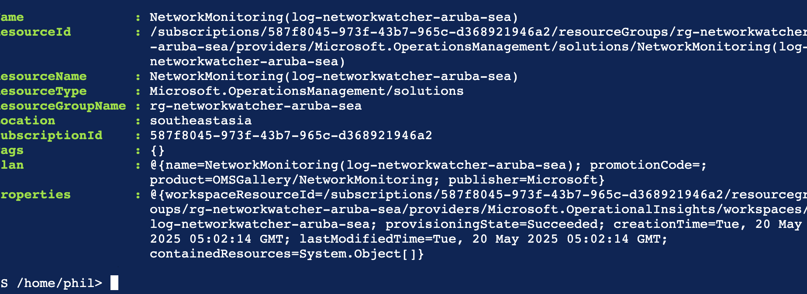
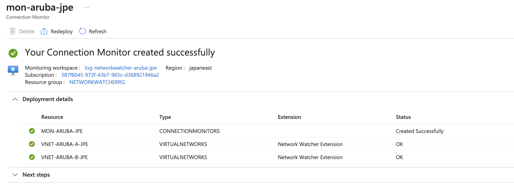
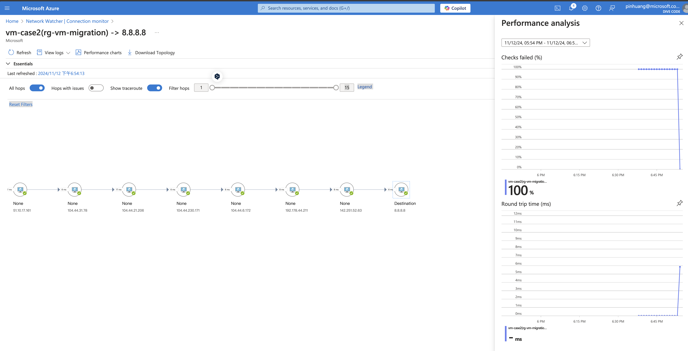

# Network Watcher Workspace

If your source VM comes from multiple regions, you need to create a separate workspace for each region and cannot mix them, and you dont need to care about destination VM or IP in this scenraio

For example:
- If there are services in Southeast Asia and Japan East that need to be monitored as source VMs, you must create a Network Watcher Workspace in both Southeast Asia and Japan East for it to function properly.

